# ADR-0001: Pluggable Output Renderers via the Plugin System

| | |
|---|---|
| **Status**   | Proposed |
| **Date**     | 2026-05-04 |
| **Supersedes** | — |
| **Superseded by** | — |
| **Related**  | [docs/plugin-system.md](../plugin-system.md), [docs/pdf-generation.md](../pdf-generation.md) |

---

## 1. Context

LCMS Core today produces output content in two formats:

- **PDF** — rendered by [`Exporters::Pdf::Base`](../../lib/exporters/pdf/base.rb), which calls `Grover.new(html).to_pdf` directly. Grover drives a headless Chromium via Puppeteer.
- **Google Doc** — rendered by [`Exporters::Gdoc::Base`](../../lib/exporters/gdoc/base.rb), which uploads HTML to Google Drive and returns a file ID/URL.

Both are invoked by background jobs (`DocumentPdfJob`, `MaterialPdfJob`, `UnitBundlePdfJob`, the corresponding `*GdocJob`s) which hard-instantiate the exporter classes.

Three forces motivate change:

1. **Accessible PDFs.** Some downstream consumers require WCAG/PDF-UA-compliant PDFs. Chromium's `page.pdf` cannot produce tagged PDF; **PrinceXML** can. We need PrinceXML available without removing Grover (Grover stays the default for the bulk of content where accessibility is not required).
2. **Format extensibility.** Future requirements include Microsoft Word (`.docx`), EPUB, and possibly alternative GDoc-style backends (OneDrive, Notion). Each addition should not require carving up `Exporters::*` again.
3. **Distribution model.** Operators should be able to opt in to backends without forking the main repo. The existing [plugin system](../plugin-system.md) (`lib/plugins/<name>/`) is the right vehicle, but it needs a stable extension point — the current renderer call is hard-coded.

The current code structure cannot accommodate any of these without invasive change every time:

```ruby
# lib/exporters/pdf/base.rb
def export
  Grover.new(pdf_content, **pdf_params).to_pdf  # hard-coded backend
end
```

Adding Prince today would mean editing this file. Adding Word would mean creating a parallel `Exporters::Docx` tree with its own hard-coded backend. Each new backend is a merge-conflict surface for forks.

## 2. Decision

We introduce **per-format backend registries** as the single, generalizable extension point for output generation.

- The **core app** owns the contract for each format: a value object for options, an abstract base class, a registry, and a default backend implementation.
- **Plugins** in `lib/plugins/<name>/` register additional backends at boot. Each plugin lives in its own namespace and depends *only* on the core contract types.
- **Jobs and exporter shells stay unchanged in shape**; the seam moves *inside* the exporter so the job layer never sees the swap.

Two contract shapes are recognized — chosen per format, not per backend:

| Contract | Output | Examples |
|---|---|---|
| **Renderer**  | `String` (file bytes)         | PDF, DOCX, EPUB, plain HTML |
| **Publisher** | external resource handle (id/URL) | Google Docs, OneDrive, Notion |

PDF uses the Renderer contract. GDoc uses the Publisher contract. New formats pick whichever fits.

## 3. Architecture

### 3.1 Layering and dependency direction

```
┌────────────────────────────────────────────────────────────────────┐
│  JOBS LAYER  (app/jobs/)                                           │
│    DocumentPdfJob   MaterialPdfJob   UnitBundlePdfJob   *GdocJob   │
│                          │                                         │
│                          ▼                                         │
├────────────────────────────────────────────────────────────────────┤
│  CORE EXPORTER LAYER  (lib/exporters/)                             │
│                                                                    │
│    Exporters::Base                                                 │
│      ├─ Exporters::Pdf::Base ── builds RenderOptions               │
│      │     └─ RendererRegistry.fetch(name).call(html, options:)    │
│      └─ Exporters::Gdoc::Base ── builds PublishOptions             │
│            └─ PublisherRegistry.fetch(name).publish(html, options:)│
│                                                                    │
│    PER-FORMAT CONTRACT (each format owns its trio)                 │
│      Pdf::RenderOptions    Pdf::Renderers::Base    Pdf::Registry   │
│      Gdoc::PublishOptions  Gdoc::Publishers::Base  Gdoc::Registry  │
│                                                                    │
│    DEFAULT BACKENDS (ship in core, registered at boot)             │
│      Pdf::Renderers::Grover                                        │
│      Gdoc::Publishers::GoogleDrive                                 │
│                                                                    │
│                          ▲ depends on / inherits from              │
├──────────────────────────┼─────────────────────────────────────────┤
│  PLUGIN LAYER            │  (lib/plugins/<name>/)                  │
│                          │                                         │
│    PrincePdf  ──────────►│  inherits Pdf::Renderers::Base          │
│    DocxExport ──────────►│  defines Docx::Renderers::*             │
│    EpubExport ──────────►│  defines Epub::Renderers::*             │
│    OneDrive   ──────────►│  inherits Gdoc::Publishers::Base        │
│                                                                    │
│  Plugins NEVER appear in core code paths.                          │
│  Discovery happens at runtime via the registries.                  │
└────────────────────────────────────────────────────────────────────┘
```

**Single dependency rule:** plugin → core. Core never imports, names, or branches on plugin code. The registry is the only contact surface, and it speaks in core types only.

#### Component dependency graph

The diagram below shows individual classes and how they connect. Edge styles encode the *kind* of dependency:

- **Solid** (`──▶`) — runtime call / instantiation
- **Dashed** (`╌▶`) — protocol satisfaction (`include`, inherit, *or* duck-typed implementation)
- **Thick** (`══▶`) — boot-time registration with a registry

```mermaid
flowchart TB
    %% =========== JOBS ===========
    subgraph JOBS["Jobs · app/jobs/"]
        direction LR
        J1[DocumentPdfJob]
        J2[MaterialPdfJob]
        J3[UnitBundlePdfJob]
        JG["DocumentGdocJob<br/>MaterialGdocJob"]
    end

    %% =========== CORE ===========
    subgraph CORE["Core · lib/exporters/"]
        direction TB
        EB["Exporters::Base"]
        PSReg["PluginSystem::Registry<br/>shared mixin"]

        subgraph PDF["PDF format"]
            direction TB
            PB["Pdf::Base"]
            PDM["Pdf::Document<br/>Pdf::Material"]
            PRO["Pdf::RenderOptions<br/>value object"]
            PRBase["Pdf::Renderers::Base<br/>abstract contract"]
            PReg["Pdf::RendererRegistry"]
            PGrover["Pdf::Renderers::Grover<br/>default backend"]
        end

        subgraph GDOC["GDoc format"]
            direction TB
            GB["Gdoc::Base"]
            GDM["Gdoc::Document<br/>Gdoc::Material"]
            GPO["Gdoc::PublishOptions"]
            GPBase["Gdoc::Publishers::Base<br/>abstract contract"]
            GReg["Gdoc::PublisherRegistry"]
            GGoogle["Gdoc::Publishers::GoogleDrive<br/>default backend"]
        end
    end

    %% =========== PLUGINS ===========
    subgraph PLUGINS["Plugins · lib/plugins/"]
        direction LR
        subgraph PP["prince_pdf"]
            PpR["PrincePdf::Renderer"]
            PpT["PrincePdf::OptionsTranslator"]
            PpE["PrincePdf::Executable"]
        end
        subgraph WP["weasy_pdf · future"]
            WpR["WeasyPdf::Renderer"]
        end
        subgraph OD["one_drive · future"]
            OdP["OneDrive::Publisher"]
        end
    end

    %% --- Job → Exporter (runtime) ---
    J1 --> PDM
    J2 --> PDM
    J3 --> PDM
    JG --> GDM

    %% --- Exporter inheritance (core) ---
    PDM -.-> PB
    PB  -.-> EB
    GDM -.-> GB
    GB  -.-> EB

    %% --- Exporter uses contract types (runtime) ---
    PB -->|builds| PRO
    PB -->|fetch backend| PReg
    GB -->|builds| GPO
    GB -->|fetch backend| GReg

    %% --- Default backends inherit Base (ergonomic) + register ---
    PGrover -.inherits.-> PRBase
    GGoogle -.inherits.-> GPBase
    PGrover ==>|register at boot| PReg
    GGoogle ==>|register at boot| GReg

    %% --- Registries share the pattern ---
    PReg -.includes.-> PSReg
    GReg -.includes.-> PSReg

    %% --- Plugin backends satisfy the protocol (inherit OR duck-type) ---
    PpR -.satisfies.-> PRBase
    WpR -.satisfies.-> PRBase
    OdP -.satisfies.-> GPBase

    %% --- Plugin internals ---
    PpR --> PpT
    PpR --> PpE

    %% --- Plugins register at boot via setup! ---
    PpR ==>|setup! registers| PReg
    WpR ==>|setup! registers| PReg
    OdP ==>|setup! registers| GReg

    %% --- Styling ---
    classDef jobBox      fill:#f3f4f6,stroke:#6b7280,color:#111827
    classDef coreBox     fill:#dbeafe,stroke:#1d4ed8,color:#1e3a8a
    classDef contractBox fill:#dcfce7,stroke:#15803d,color:#14532d
    classDef defaultBox  fill:#fef3c7,stroke:#a16207,color:#713f12
    classDef pluginBox   fill:#fce7f3,stroke:#be185d,color:#831843

    class J1,J2,J3,JG jobBox
    class EB,PB,PDM,GB,GDM coreBox
    class PRO,PRBase,PReg,GPO,GPBase,GReg,PSReg contractBox
    class PGrover,GGoogle defaultBox
    class PpR,PpT,PpE,WpR,OdP pluginBox
```



Three properties are visible at a glance:

1. **Every dashed protocol-satisfaction arrow points into core.** Plugins satisfy core contracts; core never satisfies plugin contracts. Whether a plugin gets there by inheriting `Renderers::Base` or by duck-typing the protocol directly is invisible to the registry.
2. **Every thick registration arrow points into a registry.** Whether the source is a default backend (Grover, GoogleDrive) shipped in core or a plugin (PrincePdf, OneDrive), the entry path is identical: `Registry.register(...)` at boot, validated against the protocol.
3. **Both formats share the same shape.** Replace `Pdf::*` with `Gdoc::*` and the topology is unchanged. Adding DOCX or EPUB later means stamping out a new green/amber column on the same template.

### 3.2 Per-format registry, not a global one

We deliberately do **not** introduce a single `Exporters::Registry` keyed by `(format, backend)`. Reasons:

- Each format has its own option vocabulary (`RenderOptions` for PDF is meaningless for GDoc). A unified registry would force a lowest-common-denominator interface.
- Keeping registries per format keeps each format's contract small and readable.
- Plugins target one format; one registry to talk to.

What is shared is the *pattern*. We codify it as a small mixin in `lib/plugin_system/registry.rb` (zero-cost, no behavior beyond storing/looking-up). Each format includes it.

```ruby
# lib/plugin_system/registry.rb (new, ~30 lines)
module PluginSystem::Registry
  def register(backend); ...; end
  def fetch(identifier); ...; end
  def available; ...; end          # registered AND backend.available?
  def all; ...; end                # registered (regardless of availability)
  def default; ...; end            # configurable per registry
  def unregister(identifier); end  # for tests
end
```

### 3.3 PDF Renderer contract (concrete)

The contract is a **protocol**, not a class. The base class exists for ergonomics — plugins may inherit from it for sensible defaults, or implement the protocol directly. The registry verifies the protocol at registration time, so malformed backends fail loudly at boot rather than at first call.

**The protocol**

| Member | Kind | Required | Purpose |
|---|---|---|---|
| `#call(html, options:) -> String` | instance method | **yes** | produce PDF bytes from HTML and a `RenderOptions` |
| `.identifier -> Symbol` | class method | **yes** | stable name used for registration and selection |
| `.capabilities -> Set<Symbol>` | class method | optional (default `Set.new`) | self-described capabilities for filtering / negotiation |
| `.available? -> Boolean` | class method | optional (default `true`) | boot-time probe — binary present, license loaded, etc. |
| `.layout_name -> String` | class method | optional (default `"pdf"`) | ERB layout the exporter should render before calling `#call`. The layout itself is responsible for branching on `@options[:accessibility]` to render `*_pdf_ua` partials when appropriate (§3.5). |

Capability vocabulary (extensible): `:landscape`, `:tagged_pdf`, `:pdf_ua`, `:js_execution`, `:web_fonts`, `:running_headers`, `:background_print`, `:custom_script_hook` (renderer accepts a JS hook executed during rendering — Prince via `--script=`, Grover via Puppeteer evaluation).

**`Exporters::Pdf::RenderOptions`** — frozen value object.

```ruby
RenderOptions = Data.define(
  :format,            # "Letter" | "A4" | "Legal"
  :landscape,         # Boolean
  :margin,            # { top:, right:, bottom:, left: } in CSS units
  :dpi,               # Integer or nil
  :print_background,  # Boolean
  :header_html,       # String or nil — running header
  :footer_html,       # String or nil — running footer
  :metadata,          # { title:, author:, lang: }
  :accessibility,     # :none | :tagged | :pdf_ua
  :extra              # Hash — backend-specific escape hatch
)
```

**`Exporters::Pdf::Renderers::Base`** — ergonomic, opt-in. Provides defaults so plugin authors only override what they care about. Inheriting it is the recommended path; satisfying the protocol without inheriting it is fully supported.

```ruby
class Exporters::Pdf::Renderers::Base
  def self.capabilities = Set.new
  def self.available?   = true
  def self.layout_name  = "pdf"
  # No abstract method bodies. The registry enforces the protocol.
end
```

**`Exporters::Pdf::RendererRegistry`** — runtime lookup, contract enforcer.

```ruby
module Exporters::Pdf::RendererRegistry
  extend PluginSystem::Registry

  REQUIRED_INSTANCE_METHODS = %i[call].freeze
  REQUIRED_CLASS_METHODS    = %i[identifier].freeze

  class RendererNotFound      < StandardError; end
  class RendererUnavailable   < StandardError; end
  class RenderError           < StandardError; end
  class UnsupportedCapability < StandardError; end
  class ContractViolation     < ArgumentError;  end
end
```

`PluginSystem::Registry#register` calls `verify_contract!` against `REQUIRED_INSTANCE_METHODS` and `REQUIRED_CLASS_METHODS` before storing the backend. `default` reads `ENV["DEFAULT_PDF_RENDERER"]` and falls back to `:grover`.

**`Exporters::Pdf::Renderers::Grover`** — default backend, lives in core.

```ruby
class Exporters::Pdf::Renderers::Grover < Exporters::Pdf::Renderers::Base
  def self.identifier   = :grover
  def self.capabilities = Set[:landscape, :js_execution, :web_fonts,
                              :running_headers, :background_print]

  def call(html, options:)
    ::Grover.new(html, **translate(options)).to_pdf
  end

  private

  def translate(opts)
    {
      format: opts.format,
      landscape: opts.landscape,
      margin: opts.margin,
      print_background: opts.print_background,
      display_header_footer: opts.header_html || opts.footer_html,
      header_template: opts.header_html,
      footer_template: opts.footer_html,
      prefer_css_page_size: false
    }.compact.merge(opts.extra || {})
  end
end
```

Registered in a new initializer:

```ruby
# config/initializers/pdf_renderers.rb
Exporters::Pdf::RendererRegistry.register(Exporters::Pdf::Renderers::Grover)
```

**`Exporters::Pdf::Base`** — refactored seam.

```ruby
def export
  renderer = RendererRegistry.fetch_for(identifier:    renderer_name,
                                        accessibility: accessibility_level)
  html     = render_template(template_path("show"), layout: renderer.class.layout_name)
  renderer.call(html, options: render_options)
end

private

def renderer_name
  @options[:renderer]&.to_sym ||
    (@document.respond_to?(:pdf_renderer) && @document.pdf_renderer&.to_sym) ||
    RendererRegistry.default
end

def accessibility_level
  return :pdf_ua if @options[:accessible_pdf] == true
  @options[:accessibility]&.to_sym ||
    (@document.respond_to?(:accessibility) && @document.accessibility&.to_sym) ||
    :none
end

def render_options
  RenderOptions.new(
    format: "Letter",
    landscape: @document.orientation == "Landscape",
    print_background: true,
    header_html: render_template(base_path("_header"), layout: "pdf_plain"),
    footer_html: render_template(base_path("_footer"), layout: "pdf_plain"),
    margin: margin_for(accessibility_level),
    dpi:    @document.config[:dpi],
    metadata: { title: @document.base_filename, lang: "en" },
    accessibility: accessibility_level,
    extra: {}
  )
end

# Distinct margin set for accessible mode (validated pattern from dese-lcms).
def margin_for(level)
  level == :none ? @document.config[:margin] : @document.config[:margin_accessible] || @document.config[:margin]
end
```

This is the only behavior change in core. Default output (Grover, `accessibility: :none`) is byte-identical to today.

### 3.4 Plugin packaging convention

Every backend plugin follows the same layout:

```
lib/plugins/<plugin_name>/
  Gemfile                                # backend-specific gems
  README.md                              # install, license, env vars
  lib/
    <plugin_name>.rb                     # module + setup! (registration)
    <plugin_name>/
      renderer.rb                        # or publisher.rb
      options_translator.rb              # neutral options → backend flags
      executable.rb                      # binary discovery, version probe
  app/
    views/
      layouts/
        <plugin_layout>.erb              # if backend needs a custom layout
  sig/
    <plugin_name>/                       # RBS signatures (discovered via
      renderer.rbs                       # Steepfile glob lib/plugins/*/sig)
      options_translator.rbs
  spec/
    services/<plugin_name>/...
```

Rules a plugin obeys:

1. **Own its namespace.** `PrincePdf::*`, never `Exporters::Pdf::Renderers::Prince`.
2. **Satisfy the renderer protocol.** Inheriting `Exporters::Pdf::Renderers::Base` is the easy path (sensible defaults, no boilerplate). Plugins may also implement the protocol directly without inheriting — useful for adapter-shaped wrappers around third-party gems, or when the plugin already has its own class hierarchy. The registry verifies either form at registration time.
3. **Register in `setup!`.** No autoloading side effects; registration is the single boot-time act.
4. **Probe in `available?`.** A registered-but-unavailable backend (binary missing, license absent) is allowed; the registry filters it out of `.available`.

### 3.5 Accessibility flow

Accessibility is **orthogonal to renderer selection** in the architecture, but they interact at one point: not every renderer can satisfy every accessibility level. The flow keeps the three concerns — caller intent, renderer capability, template variant — explicit and separately resolvable.

**Audience clarification.** "Caller intent" here means the *programmatic caller* — exporter, job, or plugin code — not an end user. Renderer choice and accessibility level are **not** surfaced as core-controller params or core admin forms. They are programmatic seams that case-b plugins (bespoke per-project bundle assembly) use to route different pieces of a bundle to different renderers. The only user-facing renderer-selection surface is the project default, set in settings (§4.3). See §3.0-equivalent framing summarized in §4.3 "Selection surfaces."

**Three orthogonal axes**

| Axis | Values | Source |
|---|---|---|
| Renderer | `:grover`, `:prince`, … | `options[:renderer]` → `Document#pdf_renderer` (plugin-defined accessor, absent in core) → `RendererRegistry.default` |
| Accessibility | `:none`, `:tagged`, `:pdf_ua` | `options[:accessibility]` → `Document#accessibility` (plugin-defined accessor, absent in core) → `:none` |
| Template variant | regular partials, `*_pdf_ua` partials, … | derived from accessibility level inside the layout (not selected by the exporter) |

**Programmatic caller surface**

The forms below are how plugin code or scripted jobs invoke the exporter. They are not how end users or admins request a renderer — that's the project default (§4.3).

```ruby
# Explicit (plugin code, scripted bulk jobs)
DocumentPdfJob.perform_later(doc.id, content_type: "lesson",
                             renderer: :prince,
                             accessibility: :pdf_ua)

# Shorthand (matches dese-lcms naming, ergonomic for the common case)
DocumentPdfJob.perform_later(doc.id, content_type: "lesson",
                             accessible_pdf: true)
# Internally normalized: accessible_pdf: true → accessibility: :pdf_ua

# Per-record (plugin-set, e.g. at import time by a case-b plugin)
# Requires a plugin to extend Document with an `accessibility` accessor
# that reads from metadata; core models do not define this method.
doc.update!(metadata: doc.metadata.merge("accessibility" => "pdf_ua"))
```

Resolution order inside `Exporters::Pdf::Base#render_options` (analogous to renderer resolution):

```ruby
def accessibility_level
  return :pdf_ua if @options[:accessible_pdf] == true        # shorthand
  @options[:accessibility]&.to_sym ||
    (@document.respond_to?(:accessibility) && @document.accessibility&.to_sym) ||
    :none
end
```

**Constraint enforcement at the registry**

The registry fetches by identifier *and* required capabilities. Asking for an accessible PDF from a non-accessible renderer fails fast with a clear error, not a silent compliance bug:

```ruby
module Exporters::Pdf::RendererRegistry
  CAPABILITY_FOR_ACCESSIBILITY = {
    none:   [],
    tagged: [:tagged_pdf],
    pdf_ua: [:pdf_ua]
  }.freeze

  def self.fetch_for(identifier:, accessibility: :none)
    backend = fetch(identifier)
    required = CAPABILITY_FOR_ACCESSIBILITY.fetch(accessibility)
    missing  = required - backend.class.capabilities.to_a
    return backend if missing.empty?
    raise UnsupportedCapability,
          "#{identifier} cannot satisfy accessibility=#{accessibility} " \
          "(missing capabilities: #{missing.join(', ')})"
  end
end
```

`Exporters::Pdf::Base#export` calls `fetch_for(identifier: renderer_name, accessibility: accessibility_level)` instead of plain `fetch`. The exporter never produces a PDF that silently fails its accessibility contract.

**Template branching at the layout level**

Templates do **not** branch inside the exporter. The layout the renderer declares (`Renderer.layout_name`) is responsible for rendering the right partials based on `@options[:accessibility]`. Concretely:

```erb
<%# app/views/layouts/pdf_prince.erb (shipped by prince_pdf plugin) %>
<% if @options[:accessibility] == :pdf_ua %>
  <%= render "components/overview_pdf_ua" %>
<% else %>
  <%= render "components/overview" %>
<% end %>
```

Why the layout and not the exporter:

- The exporter has no business knowing which partials map to which accessibility level — that's an authoring concern owned by templates.
- A renderer's layout *is* the contract for "what HTML this backend expects." If Prince needs PDF/UA partials, that knowledge belongs in `pdf_prince.erb`, not in `Pdf::Document`.
- Adds no public API surface — an empty `_*_pdf_ua.html.erb` set is a no-op default; the partial fork is purely additive when an operator chooses to author one.

**Auto-renderer-by-capability (rejected for v1)**

A tempting shortcut: if the caller says `accessibility: :pdf_ua` but doesn't specify a renderer, the registry could auto-pick the first registered renderer with `:pdf_ua` capability. **Rejected for v1.** Implicit renderer selection on accessibility-required output is exactly the kind of thing that produces "it worked locally, why is the prod PDF watermarked?" tickets. Operators must opt in to a renderer; if they want `:prince` to be the auto-default for accessible output, they set `DEFAULT_PDF_RENDERER=prince` and we let the explicit chain do its job.

### 3.6 Type signatures (RBS)

The contract is the protocol; the protocol is the surface that benefits most from typing. Sister project `dese-lcms` uses RBS + Steep actively (`Steepfile` + full `sig/` tree mirroring `lib/`). lcms-core has `gem "rbs_rails"` and `gem "steep"` in the development group but no `Steepfile` or `sig/` yet — the tooling is queued, the infrastructure isn't wired up.

This ADR ships RBS signatures for the contract types so they are typed from day one. Activating Steep in lcms-core (Stage A.1 in §9) is a one-time small step — Steepfile + `sig/` discovery — and is forward-compatible with whatever broader RBS rollout the team chooses.

**`sig/lib/exporters/pdf/render_options.rbs`**

```rbs
module Exporters
  module Pdf
    class RenderOptions
      type accessibility = :none | :tagged | :pdf_ua
      type margin_box   = { top: String, right: String, bottom: String, left: String }

      attr_reader format: String
      attr_reader landscape: bool
      attr_reader margin: margin_box
      attr_reader dpi: Integer?
      attr_reader print_background: bool
      attr_reader header_html: String?
      attr_reader footer_html: String?
      attr_reader metadata: Hash[Symbol, untyped]
      attr_reader accessibility: accessibility
      attr_reader extra: Hash[Symbol, untyped]
    end
  end
end
```

**`sig/lib/exporters/pdf/renderers/base.rbs`**

```rbs
module Exporters
  module Pdf
    module Renderers
      class Base
        def call: (String html, options: RenderOptions) -> String
        def self.identifier: () -> Symbol
        def self.capabilities: () -> Set[Symbol]
        def self.available?: () -> bool
        def self.layout_name: () -> String
      end
    end
  end
end
```

**`sig/lib/exporters/pdf/renderer_registry.rbs`**

```rbs
module Exporters
  module Pdf
    module RendererRegistry
      interface _Renderer
        def call: (String, options: RenderOptions) -> String
      end

      class RendererNotFound      < StandardError end
      class RendererUnavailable   < StandardError end
      class RenderError           < StandardError end
      class UnsupportedCapability < StandardError end
      class ContractViolation     < ArgumentError end

      CAPABILITY_FOR_ACCESSIBILITY: Hash[Symbol, Array[Symbol]]
      REQUIRED_INSTANCE_METHODS:    Array[Symbol]
      REQUIRED_CLASS_METHODS:       Array[Symbol]

      def self.register: (Class | _Renderer) -> void
      def self.unregister: (Symbol) -> void
      def self.fetch: (Symbol identifier) -> _Renderer
      def self.fetch_for: (identifier: Symbol, ?accessibility: Symbol) -> _Renderer
      def self.available: () -> Array[Symbol]
      def self.all:       () -> Array[Symbol]
      def self.default:   () -> Symbol
    end
  end
end
```

**Plugin signature** — co-located with the plugin (`lib/plugins/prince_pdf/sig/`), discovered via a Steepfile glob. Lifts the dese-lcms shape almost verbatim:

```rbs
# lib/plugins/prince_pdf/sig/prince_pdf/renderer.rbs
module PrincePdf
  class Renderer < ::Exporters::Pdf::Renderers::Base
    def self.identifier:   () -> Symbol
    def self.layout_name:  () -> String
    def self.capabilities: () -> Set[Symbol]
    def self.available?:   () -> bool
    def call: (String html, options: ::Exporters::Pdf::RenderOptions) -> String
  end

  class OptionsTranslator
    def initialize: (::Exporters::Pdf::RenderOptions) -> void
    def to_args:    () -> Array[String]
  end

  module Executable
    def self.present?: () -> bool
    def self.path:     () -> String?
  end
end
```

**Steepfile additions**

```ruby
# Steepfile (new file)
target :lib do
  signature "sig", "lib/plugins/*/sig"   # core sig + plugin sigs
  check "lib"
  library "net-http", "set"
end
```

This mirrors dese-lcms's `Steepfile` shape, with one extension: a glob over `lib/plugins/*/sig` so plugin signatures are discovered without naming each plugin. Plugin-shipped signatures travel with the plugin directory and are checked alongside core in one Steep run.

## 4. Worked example: PrincePdf plugin

Path: `lib/plugins/prince_pdf/`. Ships in this repo (out-of-the-box), not as a submodule.

### 4.1 Files

```
lib/plugins/prince_pdf/
  Gemfile                                # backend-specific gems (none required; system binary)
  README.md
  lib/
    prince_pdf.rb
    prince_pdf/
      renderer.rb
      options_translator.rb
      executable.rb
      assets/
        prince_xml.css                   # PDF/UA tagging stylesheet
        prince_xml_landscape.css
        prince_xml_portrait.css
        prince_xml.js                    # custom JS hook
  app/
    views/
      layouts/
        pdf_prince.erb                   # @page CSS, lang, accessibility-aware partial selection
  sig/
    prince_pdf/
      renderer.rbs
      options_translator.rbs
      executable.rbs
  spec/
    services/prince_pdf/renderer_spec.rb        # Open3 stubbed
    services/prince_pdf/options_translator_spec.rb
    integration/prince_pdf_spec.rb              # gated on PRINCE_EXECUTABLE_PATH
```

System-level provisioning (the `prince` .deb install for Docker and Cloud66) lives in the **main repo**, not under the plugin — see §4.4 for the rationale.

### 4.2 Code

```ruby
# lib/plugins/prince_pdf/lib/prince_pdf.rb
module PrincePdf
  def self.setup!
    Exporters::Pdf::RendererRegistry.register(Renderer)
    PluginSystem.logger.info \
      "[PrincePdf] :prince renderer registered (available=#{Renderer.available?})"
  end
end

# lib/plugins/prince_pdf/lib/prince_pdf/renderer.rb
# Path A — recommended: inherit Base for default capabilities/available?/layout_name,
# override only what differs. Command shape and flags are validated by the
# production implementation in the dese-lcms project (Prince 16.1, PDF/UA-1).
module PrincePdf
  class Renderer < Exporters::Pdf::Renderers::Base
    def self.identifier   = :prince
    def self.layout_name  = "pdf_prince"
    def self.capabilities = Set[:landscape, :tagged_pdf, :pdf_ua,
                                :running_headers, :web_fonts,
                                :js_execution, :custom_script_hook]

    def self.available?
      Executable.present?
    end

    def call(html, options:)
      args = OptionsTranslator.new(options).to_args
      stdout, stderr, status = Open3.capture3(*args, stdin_data: html)
      raise Exporters::Pdf::RendererRegistry::RenderError, stderr unless status.success?
      stdout
    end
  end
end

# OptionsTranslator produces a command of the validated shape:
#
#   prince - --output=-                                # stdin → stdout
#   --license-file=<PRINCE_LICENSE_PATH>               # if configured
#   --style=prince_xml.css                             # tagging stylesheet (PDF/UA)
#   --style=prince_xml_<orientation>.css               # orientation-specific
#   --page-margin="<top> <right> <bottom> <left>"
#   --script=prince_xml.js                             # custom JS hook
#   --javascript                                       # enable JS execution
#   --http-timeout=30
#   --pdf-profile=PDF/UA-1                             # iff RenderOptions#accessibility == :pdf_ua
```

**`OptionsTranslator` accessibility mapping**

```ruby
def accessibility_args(options)
  case options.accessibility
  when :none   then []
  when :tagged then ["--tagged-pdf"]                # tagged but not certified PDF/UA
  when :pdf_ua then ["--pdf-profile=PDF/UA-1"]      # certified profile
  else raise ArgumentError, "unknown accessibility level: #{options.accessibility}"
  end
end
```

Grover's translator does the same in reverse: any non-`:none` accessibility raises (Grover's capabilities don't include `:tagged_pdf` or `:pdf_ua`), but in practice the registry's `fetch_for` rejects this combination earlier (§3.5), so the renderer never sees it.

A protocol-only equivalent (no inheritance) is equally valid — useful when wrapping a third-party object or when the plugin already has its own class hierarchy:

```ruby
# Path B — protocol only, no coupling to Renderers::Base.
module WeasyPdf
  class Renderer
    def self.identifier   = :weasy
    def self.capabilities = Set[:tagged_pdf, :web_fonts]
    def self.available?   = system("weasyprint --version > /dev/null 2>&1")
    def self.layout_name  = "pdf_weasy"

    def call(html, options:); ...; end
  end
end
```

The registry's `verify_contract!` accepts either form and rejects anything that misses `#call` or `.identifier`.

### 4.3 Configuration surface

| Variable                  | Purpose |
|---------------------------|---------|
| `DEFAULT_PDF_RENDERER`    | Global default. Defaults to `:grover`. |
| `PRINCE_EXECUTABLE_PATH`  | Path to `prince` binary (default: `/usr/bin/prince` after .deb install). |
| `PRINCE_LICENSE_PATH`     | Absolute path to `license.dat`; if unset, Prince looks in its install directory. Without a license, output is watermarked. |
| `PRINCE_HTTP_TIMEOUT`     | Override default `--http-timeout=30` for remote-resource fetches. |

Plugin exposes a configuration block consumed in an initializer:

```ruby
# config/initializers/prince_pdf.rb (auto-loaded by plugin Gemfile chain)
PrincePdf::Renderer.configure do |c|
  c.license_file = ENV.fetch("PRINCE_LICENSE_PATH", nil)
end
```

On Cloud66, the validated convention (from dese-lcms) is to store the license at `$STACK_BASE/shared/princexml/license.dat` and set `PRINCE_LICENSE_PATH` accordingly. The plugin README documents this verbatim.

**Selection surfaces (two-tier model)**

Renderer selection in lcms-core core follows a deliberate two-tier split. Conflating the tiers leads to wasted scope (e.g. building admin UI for a per-record toggle that should live in a plugin).

| Tier | Audience | Where it lives | How it's set |
|---|---|---|---|
| **Project default** | Admin / operator | Settings UI (deferred to the `config/pdf.yml → DB` follow-up scope); interim mechanism is the `DEFAULT_PDF_RENDERER` env var read by `RendererRegistry.default`. | Picked from the list of registered renderers. The only renderer-selection surface exposed in core UI. |
| **Per-call / per-record routing** | Plugin code | `options[:renderer]` / `options[:accessibility]` at the exporter call site, or a plugin-defined `pdf_renderer` / `accessibility` accessor on Document/Material. | Case-b plugins (per-project bundle assembly) write these to route specific pieces of a bundle to specific renderers — for example, bundling forces a single Prince pass over composed HTML because PDF/UA tags don't survive PDF concatenation, so the plugin sets the renderer explicitly when assembling the bundle. Core models do not define `pdf_renderer` / `accessibility` accessors; a plugin opts in by extending them with methods that read from `metadata` jsonb. |

Resolution order in `Exporters::Pdf::Base` is preserved: option → record → default. The combination is validated by `RendererRegistry.fetch_for` before any HTML is rendered (§3.5). Real columns for `pdf_renderer` / `accessibility` can be promoted later if a plugin needs persistence ergonomics beyond jsonb metadata.

**What this rules out for core:**
- No `?type=pdf_ua` or similar query-param plumbing in public controllers (that's a dese-lcms case-b artifact).
- No "PDF / PDF/UA" two-button UX on documents/materials show pages.
- No admin form fields for per-document renderer/accessibility metadata.
These belong inside a case-b plugin if a downstream project needs them.

### 4.4 Docker and Cloud66 integration

System-level dependencies for plugins (Prince's .deb being the only current example) are installed by the **main repo**, not by the plugin folder. Two surfaces:

- **Docker** — `Dockerfile.dev` contains a multi-arch RUN block (amd64 + arm64) that detects the build architecture and installs the matching `prince_16-1_debian12_*.deb`. Base image is pinned to `ruby:3.4.7-slim-bookworm` because Prince's bookworm package depends on libs (`libavif15`, etc.) that trixie has replaced. An `apt-get update` is required inside the install layer because the previous layer wipes `/var/lib/apt/lists`.
- **Cloud66** — `.cloud66/scripts/install-prince-xml.sh` is wired as a `first_thing` deploy hook in `.cloud66/deploy_hooks.yml` with `apply_during: all`. The script is idempotent (skips if `prince` is already on PATH), detects ubuntu22.04 vs debian12 from `/etc/os-release`, picks the matching .deb, and installs `wget`/`gdebi` on demand.

**Why not in the plugin folder?**

A plugin-local installer model was considered and rejected for v1. A central convention (e.g. `lib/plugins/*/provision/docker.sh` iterated from `Dockerfile.dev`, driven by a YAML manifest of enabled plugins) is technically clean, but:

- **Build time and runtime live in different process scopes.** The Ruby plugin registry doesn't exist when `docker build` runs; any iteration has to be shell- or pure-Ruby-without-Rails. That's not insurmountable, but it adds a second discovery layer separate from `PluginSystem.load_all`.
- **Auditability vs self-containment.** A single Dockerfile.dev block is easier to reason about than a scanner that fans out into per-plugin scripts; cache invalidation behaves more predictably; install order is explicit if plugins ever inter-depend.
- **Plugin count.** With one plugin today, the central declaration is clearer than a scanning convention. The break-even is somewhere around 3+ plugins shipping their own provisioning.

When that threshold is crossed — or when a fork wants to drop a plugin in without editing main-repo files — this decision should be revisited. The plugin folder layout deliberately leaves room for it (no provisioning files exist now; adding a `provision/` subdir later is non-breaking).

**Availability gating**

If the install steps fail or are skipped on a given host, `Renderer.available?` returns `false`, the registry filters `:prince` out of `.available`, and any record asking for `:prince` fails fast with `RendererUnavailable` — silent fallback to Grover is not allowed.

### 4.5 Implementation patterns validated by dese-lcms

A working PrinceXML integration ships in [`~/Projects/LT/dese-lcms`](../../../dese-lcms/). It validates the renderer mechanics this ADR proposes, while taking a different (lighter) integration path. Concrete patterns to lift:

| Pattern | What it is | How it informs the plugin |
|---|---|---|
| **CSS-driven PDF/UA tagging** | `prince_xml.css` declares `prince-pdf-tag-type: Part \| Sect \| H2 \| H3 \| P \| L \| LI \| Lbl \| LBody \| Artifact` for each semantic role. | The plugin must ship a tagging stylesheet, not just a layout. Tagging is a CSS responsibility, not a renderer-flag responsibility. |
| **Decorative-image affordance** | `application_helper` adds an `icon-as-artifact` CSS class so decorative images map to PDF Artifact (skipped by screen readers). | Plugin should expose a small helper module that the host app can include into its `ApplicationHelper` to mark decorative content. |
| **Per-orientation stylesheet** | `prince_xml_landscape.css` / `prince_xml_portrait.css` loaded conditionally via `--style=`. | `OptionsTranslator` selects orientation CSS based on `RenderOptions#landscape`. |
| **Custom JS hook** | `--script=prince_xml.js` — a Prince-specific JS file that runs inside the rendering context. Used for runtime DOM tweaks Prince needs but the host templates can't bake in. | Plugin ships `prince_xml.js`; tests assert it's loaded via `--script=`. |
| **Distinct margin set for accessible mode** | `gutter_margins_for(:margin_accessible, ...)` returns different values from the regular `:margin` key. | When `RenderOptions#accessibility != :none`, source the margin set from a separate config branch. Forwards-compatible with the upcoming `config/pdf.yml` → DB migration. |
| **Template fork at the partial level** | Every PDF component has a `_*_pdf_ua.html.erb` sibling (12+ partials in dese-lcms across clusters/units). | **Scope flag.** Stage B's "ship a Prince layout" understates the work. Plan for one partial fork per PDF component. Migration plan §9 updated. |
| **Eliminates post-processing tooling** | Switching to Prince let dese-lcms delete the entire `pdf_meta_tool` (PDF metadata injection) and an HTML pre-processor (`convert_ol_to_div` for `<ol>` rendering). | Concrete positive consequence: a real paged-media engine reduces the surrounding tool surface. Recorded in §7. |
| **Open3 + stdin/stdout** | `Open3.capture3("prince", "-", "--output=-", *flags, stdin_data: html)`. No temp files. | The plugin's `Executable` wraps exactly this. Tested with Open3 stubbed (see [dese-lcms spec](../../../dese-lcms/spec/lib/lcms/engine/renderer/prince_xml_spec.rb)). |
| **Configuration class with env fallback** | `PrinceXml::Configuration` + `.configure { \|c\| c.license_file = ENV.fetch(...) }`. | Plugin uses the same shape; initializer reads `PRINCE_LICENSE_PATH`. |

The dese-lcms integration **predates this ADR** and uses a direct branch in `Exporters::Pdf::Base#export` (`if accessible_pdf? then PrinceXml.new.pdf_from_string ...`). It works because there are exactly two renderers and no per-record renderer selection — the option flag `type: "pdf_ua"` doubles as content type and renderer identifier. That approach is recorded in §8 (Alternative G) as the design we deliberately step away from for `lcms-core`. The renderer class itself is fully reusable; the *integration path* is what changes.

## 5. Extension catalog

The same registry pattern accommodates all near- and mid-term needs.

### 5.1 Alternative PDF backends — same registry

Adding **WeasyPrint** or **wkhtmltopdf**: a new plugin under `lib/plugins/`, a new `Renderer < Exporters::Pdf::Renderers::Base`, register in `setup!`. No core change.

### 5.2 New format: DOCX (Microsoft Word)

DOCX is a Renderer-shaped format (HTML in, bytes out). It needs a parallel trio in core:

```
lib/exporters/docx/
  base.rb                          # Exporters::Docx::Base < Exporters::Base
  document.rb
  material.rb
  render_options.rb
  renderer_registry.rb
  renderers/
    base.rb
    pandoc.rb                      # default if we pick one to ship
```

Plus jobs (`DocumentDocxJob`, `MaterialDocxJob`) modeled on the PDF jobs.

Plugins for DOCX: `lib/plugins/libreoffice_docx/`, `lib/plugins/caracal_docx/`, etc. Each registers an alternative `Docx::Renderers::Base` subclass.

The **format trio (RenderOptions, Renderers::Base, RendererRegistry) is duplicated** for each new format — intentionally. Each format's option vocabulary differs.

### 5.3 New format: EPUB

Identical shape to DOCX. `Exporters::Epub::*`, default backend (e.g. `gepub`), plugins for alternatives.

### 5.4 GDoc — Publisher contract variant

GDoc is **not** a Renderer. It does not return bytes; it creates an external resource and returns a handle.

```ruby
class Exporters::Gdoc::Publishers::Base
  def publish(html, options:)
    # => Exporters::Gdoc::Result.new(id:, url:)
  end
  def self.identifier; end
  def self.available?; true; end
end
```

Default backend `Exporters::Gdoc::Publishers::GoogleDrive` (extracted from current `Exporters::Gdoc::Base`). Plugins can add `OneDrivePublisher`, `NotionPublisher`, etc.

The Publisher contract differs from Renderer in:
- Return type (`Result` value object instead of bytes)
- Side effects allowed (network, external resource creation)
- Options shape (`PublishOptions` includes folder ID, file ID for updates, retry policy)

But the **registry mechanics are identical** — `PluginSystem::Registry` mixin, `register/fetch/available/default`, plugin lifecycle, namespace rules.

### 5.5 Comparison table

| Format | Contract | Default backend (core) | Example plugin backends |
|---|---|---|---|
| PDF    | Renderer  | Grover            | PrincePdf, WeasyPdf, WkhtmltopdfPdf |
| DOCX   | Renderer  | Pandoc / Caracal  | LibreOfficeDocx |
| EPUB   | Renderer  | Gepub             | CalibreEpub |
| GDoc   | Publisher | GoogleDrive       | OneDrivePublisher, NotionPublisher |
| HTML   | Renderer  | (trivial passthrough) | — |

## 6. Plugin lifecycle

| Phase | What happens |
|---|---|
| Boot — Rails initializers | Core registers default backends (`Renderers::Grover`, `Publishers::GoogleDrive`). |
| Boot — `PluginSystem.load_all` | Each plugin's main module is constantized; `setup!` runs and calls `Registry.register(Backend)`. |
| Boot — log line | `[PluginSystem] Loaded N plugin(s): ...` |
| Per-job runtime | Exporter resolves backend name (option > record field > registry default) and calls `Registry.fetch(name).call/publish`. |
| Backend unavailable | `Registry.fetch` raises `BackendUnavailable`. **No silent fallback.** Optional opt-in `fallback_to_default: true` per call for non-critical paths. |
| Plugin removal | Delete `lib/plugins/<name>/`, remove plugin's gem entries, restart. Registry forgets the backend; records still pointing at it surface `BackendNotFound` on next render — correct behavior, not a bug. |

**Fail-fast on unavailability.** A `:prince` request silently falling back to `:grover` would produce a non-accessible PDF for an accessibility-required record. That is a correctness bug, not a graceful degradation.

## 7. Consequences

### Positive

- **One seam, one rule.** Adding a backend never edits jobs, exporters, or other plugins.
- **Plugin removability.** Deleting a plugin directory leaves no dangling references in core.
- **Testable in isolation.** Each backend takes HTML + options and returns bytes (or a Result). Trivial to unit-test with stubbed binaries / network.
- **Capability negotiation.** Admin UI can filter renderers by capability (e.g., only show `:tagged_pdf`-capable backends for accessibility-required records).
- **Format symmetry.** PDF, DOCX, EPUB, GDoc, future formats all follow one of two contract shapes.
- **Fork-friendly.** Forks add private backends without touching core files; merge surface is unchanged.
- **Decoupled from config source-of-truth.** Renderers consume `RenderOptions`. Whether those values originate from `config/pdf.yml`, jsonb metadata on a record, or a future DB-backed Setting model is transparent to every backend. The upcoming migration of `config/pdf.yml` to the database (next planned task after this ADR) requires zero changes inside any renderer.
- **Protocol-based, not inheritance-based.** Plugins satisfy a small protocol (`#call`, `.identifier`, optionally `.capabilities`/`.available?`/`.layout_name`); inheriting `Renderers::Base` is a convenience, not a requirement. Plugins keep their own class hierarchy; the registry validates contract compliance at boot, so violations surface immediately and clearly. Coupling between plugin and core is exactly the protocol — no more, no less.
- **Reduces surrounding tool surface.** A real paged-media renderer (Prince) absorbs work that previously needed standalone post-processing tools. dese-lcms removed `pdf_meta_tool` (PDF metadata injection) and an HTML pre-processor (`convert_ol_to_div` for ordered-list rendering quirks) when it adopted Prince. Adopting it here is expected to do the same.

### Negative

- **Format trio duplication.** Each new format duplicates the `(Options, Backend::Base, Registry)` trio. This is deliberate (each format has its own option vocabulary), but it is real boilerplate. A code generator (`rails g exporter:format <name>`) could mitigate later if the count grows.
- **Two contract shapes (Renderer vs Publisher), not one.** A single uniform interface would be simpler in some respects but would force GDoc and PDF to share a contract that fits neither well. The duplication is the lesser evil.
- **Layout-name leak.** The renderer declares its preferred ERB layout (`Renderer.layout_name`). This is a small coupling between rendering backend and view layer. Acceptable; alternatives (template inheritance, view-resolver chains) cost more.
- **Out-of-the-box plugin ≠ free.** PrincePdf shipping in-tree does not ship the Prince binary or license. The README must communicate this loudly.

## 8. Alternatives considered

### A. Subclass and override the exporter directly

Plugin defines `Exporters::Pdf::Prince::Document` and a job picks it. **Rejected:** jobs become aware of backends; switching renderer per record requires mutating the job; Zeitwerk autoload paths get awkward for cross-tree namespaces.

### B. Single global `Exporters::Registry` keyed by `(format, backend)`

Rejected for the option-vocabulary reason in §3.2. Unified key buys polymorphism we don't actually use; PDF jobs never call DOCX backends.

### C. Strategy injection at the job level

Job receives `renderer_class:` argument and instantiates it. Rejected: pushes backend selection into every caller; doesn't support per-record selection without job-level coupling; loses the runtime registry for capability discovery.

### D. Rack-style middleware chain for rendering

Pipeline of "transformers" that incrementally turn a Document into bytes. **Rejected as premature.** No current need; can be retrofitted inside a single Renderer if a backend ever wants pipelining internally.

### E. Use Action Dispatch's MIME type / responder system

Tempting (Rails-native, well-known). Rejected: MIME types describe what a *controller* responds with for HTTP, not how an export job picks among multiple backends for the same MIME type. We need named backends inside one MIME type.

### F. Make `Renderers::Base` mandatory (inheritance-required contract)

Earlier draft of this ADR required `class PrincePdf::Renderer < Exporters::Pdf::Renderers::Base`. **Rejected** in favor of a protocol checked by the registry. Inheritance-as-requirement creates a hard load-time dependency on a core class, forecloses a plugin's other inheritance choices (single-inheritance Ruby), and silently breaks plugins when `Base` grows new abstract methods. The protocol-with-optional-base design preserves the ergonomic path for the common case while keeping coupling at the protocol level.

### G. Direct branch in `Base#export` (the dese-lcms pattern)

Production reference implementation in `dese-lcms` selects the renderer with a direct conditional:

```ruby
# dese-lcms: lib/dese/exporters/pdf/base.rb
if accessible_pdf?
  ::Lcms::Engine::Renderer::PrinceXml.new.pdf_from_string(content, params)
else
  WickedPdf.new.pdf_from_string(content, params)
end
```

`accessible_pdf?` is `@options[:type] == "pdf_ua"`. Selection is one boolean; the renderer is hard-coded into both branches.

**Why this works for dese-lcms:** exactly two renderers, no per-record selection beyond the type flag, single tenant of the codebase. Adding a third renderer or per-record renderer choice would require expanding the conditional and propagating it into 5+ exporter subclasses (`cluster_level_material`, `unit_level_material`, `material`, `assessment_lesson`, `master_copies` all carry the same `if accessible_pdf?` branching today).

**Why we reject it for `lcms-core`:** lcms-core is the upstream consumed by multiple forks. Branches in core code force every fork to merge through the same conditional whenever a new renderer is added; a registry localizes the change to one `register` call. The dese-lcms renderer code itself remains useful — only the integration path differs.

## 9. Migration plan

| Stage | Scope | Behavior change |
|---|---|---|
| **A** Core refactor | Add `RenderOptions`, `Renderers::Base` (ergonomic, opt-in), `RendererRegistry` with protocol verifier, `Renderers::Grover`. Refactor `Exporters::Pdf::Base#export` to use the registry. Register `:grover` in initializer. | None — output is byte-identical. |
| **A.1** Activate Steep | Add `Steepfile` (mirrors dese-lcms shape; signature globs include `lib/plugins/*/sig`). Add `sig/lib/exporters/pdf/{render_options,renderer_registry,renderers/base}.rbs` covering Stage A's contract types. Wire `bundle exec steep check` into the pre-push or CI pipeline. | None at runtime; type-checking pipeline gains a baseline. |
| **B** Plugin: `prince_pdf` | New plugin under `lib/plugins/`. `setup!` registers `:prince`. Renderer + `OptionsTranslator` + `Executable` (lifted from dese-lcms reference impl). Ships `prince_xml.css` (PDF/UA tagging), `prince_xml_landscape.css`, `prince_xml_portrait.css`, `prince_xml.js` (custom hook), Dockerfile snippet, install script, README, `sig/prince_pdf/*.rbs`. Specs with `Open3` stubbed. **Template authoring is a separate non-trivial scope item**: each PDF component needs a `_*_pdf_ua.html.erb` partial — see §4.5. | None until a record opts in. |
| **C** Selection surface | Add `Document#pdf_renderer` reader (jsonb-backed). Document admin instructions. | None until an admin sets it. |
| **D** Generalize: shared registry mixin | Extract `PluginSystem::Registry`. PDF registry uses it. | None. |
| **E** GDoc parity (deferred) | Apply the same shape to GDoc: `Publishers::Base`, `PublisherRegistry`, extract `GoogleDrive` publisher. | None. |
| **F** DOCX (deferred, separate ADR) | New format trio + jobs + at least one backend. | New feature. |

Stages A through D (including A.1) are the scope of this ADR. E and F are referenced for forward-compatibility validation only.

### 9.1 Adjacent work: `config/pdf.yml` → database

Lead engineer has scoped the migration of [config/pdf.yml](../../config/pdf.yml) to the database as the **next task immediately after this ADR ships**. It is intentionally not part of this ADR's scope, but the renderer architecture is forward-compatible with it:

- `Exporters::Pdf::Base#render_options` builds `RenderOptions` from whatever source `ContentPresenter#config` exposes. Swapping the YAML loader for a DB-backed `Setting` lookup (or per-record jsonb metadata) is a change inside the presenter, not inside any renderer.
- The two concerns currently mixed in `config/pdf.yml` — page layout (`margin`, `dpi`, `orientation`) and template behavior (`header`, `name_date`, `padding`) — should be separated as part of that migration. Page layout flows into `RenderOptions`; template behavior stays in the presenter and is consumed by ERB.
- Per-record overrides become natural to add at that point, mirroring the per-record `pdf_renderer` resolution chain established in §4.3.

A separate ADR will cover the data model, admin UI, and cache-invalidation strategy.

## 10. References

- [docs/plugin-system.md](../plugin-system.md) — plugin discovery, autoload, menu registry
- [docs/pdf-generation.md](../pdf-generation.md) — current Grover/Puppeteer setup
- [lib/exporters/pdf/base.rb](../../lib/exporters/pdf/base.rb) — current PDF exporter
- [lib/exporters/gdoc/base.rb](../../lib/exporters/gdoc/base.rb) — current GDoc exporter
- [lib/plugin_system.rb](../../lib/plugin_system.rb) — plugin system core
- `~/Projects/LT/dese-lcms/lib/lcms/engine/renderer/prince_xml.rb` — production-validated PrinceXML renderer (reference for plugin implementation)
- `~/Projects/LT/dese-lcms/spec/lib/lcms/engine/renderer/prince_xml_spec.rb` — Open3-stubbed spec pattern
- `~/Projects/LT/dese-lcms/lib/lcms/engine/renderer/prince_xml.css` — PDF/UA tagging stylesheet
- `~/Projects/LT/dese-lcms/.cloud66/install_prince_xml.sh` — runtime install script reference
- `~/Projects/LT/dese-lcms/docs/princexml-license.md` — license-on-server convention
- PrinceXML documentation — https://www.princexml.com/doc/
- PrinceXML PDF tagging guide — https://www.princexml.com/doc/tagged-pdf/
- Grover gem — https://github.com/Studiosity/grover
- Michael Nygard, *Documenting Architecture Decisions* — https://cognitect.com/blog/2011/11/15/documenting-architecture-decisions
